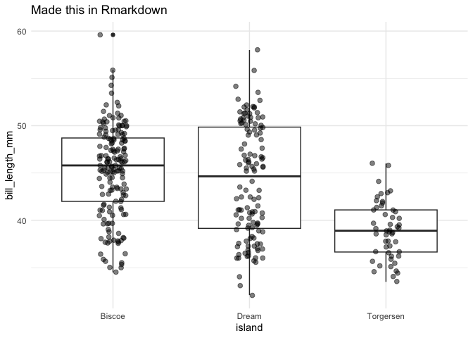

I write a lot of R in my life. I’m also a web developer that does most
of my writing on this blog in markdown. Up until now these two worlds
have been separate. I know and use
[Rmarkdown](https://rmarkdown.rstudio.com/) at work to write reports
but, it always has seemed like a pain to get Rmarkdown to work on this
site which is generated using [11ty](https://www.11ty.dev/) (Eleventy).
Up until now, to get my R work on this site, I have been writing R in
another document and manually copying over code and outputs to markdown
files. Given how inefficient that process is, I figured it was time to
figure out how to write Rmarkdown and render it more seamlessly with
this site.

To be clear, this isn’t some automated system to get Rmarkdown to build
with Eleventy. What it is, is a system to write Rmarkdown, then render
that document to a markdown file using R so that Eleventy, or another
static site generator, can build it into the site. This also isn’t a
process for folks who just want to write Rmarkdown and nothing else. For
those folks I’d recommend something like
[Blogdown](https://github.com/rstudio/blogdown) or the new
[Quarto](https://quarto.org/). This is kind of a unique case because I
post about things other than R on my blog so I like the flexibility of a
non R centric system.

As proof of concept, this page is a Rmarkdown document that I’m
rendering to a `md` document and converting to `html` with Eleventy.

## Eleventy Setup & Configuration

First, you need to put your Rmarkdown file in a **folder**, that resides
with the rest of your posts (mine is just named `blog/`). The folder
should be named like a post typically would be with the post slug. For
example, I put this post in a folder named `2023-02-03-test-rmd/` (see
the url). Within that folder create an Rmarkdown file and name it
`index.Rmd`. Now after you write your post, you can run
`rmarkdown::render("2023-02-03-test-rmd/index.Rmd")` and a `index.md`
file will be rendered in your slug named folder. Additionally, a folder
of images named `index_files/` will be created with all of your assets
that Rmarkdown generates, which is typically just images of plots. The
image paths that are created during the render in the `md` file should
work without any Eleventy changes (after completing the next step). I’m
not sure about other static site generators, but I would imagine this
would work in most.

Next, we need to make some Eleventy config (`.eleventy.js` for most)
changes, so that images generated by Rmarkdown will be added to the
\_site folder in the correct location. Rmarkdown `render` generates all
documents in the current folder, including the images. The way I have my
11ty site setup currently is that I put all images in a assets folder
that is outside the posts folder and I add a pass through copy to the
site folder of just that assets folder. No other images are copied to
the site folder. If the goal is to make this as easy as possible we need
to add a line to our configuration that will copy all images to our
`_site` folder from the `blog` (or whatever your posts folder is),
keeping their file location. To do this you can add a
`addPassthroughCopy()` in your `.eleventy.js` configuration file that
will copy all images within a specific folder.

``` js
module.exports = function(eleventyConfig){
  eleventyConfig.addPassthroughCopy("blog/r/**/*.png")
}
```

I limited to the copy to my `blog/r/` folder because that is where
Rmarkdown files will be, and I don’t want to copy over my `assets/`
folder twice which would return an error. That’s it. That is all the
Eleventy configuration you need to do. Now let’s move on the Rmarkdown
file.

## Rmarkdown front matter

The front matter in your Rmardown post should be whatever it is for a
typical post and additional an `output:` section for Rmarkdown. Once
your Rmarkdown is rendered to md Eleventy will ignore your `output:`
tag. My front matter for this post looks like this:

``` yml
---
layout: post
title: 'Using Rmarkdown with Eleventy'
author: 'Michael Schmidt'
date: '2023-02-03'
tags: ["Test Tag"]
# Above this is Eleventy. Below this is Rmarkdown
output:
  md_document:
    variant: commonmark
    preserve_yaml: TRUE
    df_print: tibble
---
```

The output section tells Rmarkdown that this is a markdown document with
`md_document`, that is rendered using `commonmark` syntax, preserving
the yaml (otherwise it is removed), and the `df_print: tibble` is
optional to output tables in truncated fashion.

The last thing I needed to do was add a chunk option for my Rmarkdown
chunks that would wrap the chunk outputs in code blocks. If you don’t do
this they are printed as plain text. You can do this like so:

``` r
knitr::opts_chunk$set(
  class.output="r"
)
```

After that you should be able to write Rmarkdown in you Eleventy site.
When you render the Rmarkdown, it should create a markdown document that
can be ingested by Eleventy to make static html.

As proof, below is just Rmarkdown rendered with
\`rmarkdown::render(“path/to/index.Rmd”)

``` r
library(palmerpenguins)
library(tidyverse)
```

``` r
penguins
```

``` r
## # A tibble: 344 × 8
##    species island    bill_length_mm bill_depth_mm flipper_length_mm body_mass_g sex     year
##    <fct>   <fct>              <dbl>         <dbl>             <int>       <int> <fct>  <int>
##  1 Adelie  Torgersen           39.1          18.7               181        3750 male    2007
##  2 Adelie  Torgersen           39.5          17.4               186        3800 female  2007
##  3 Adelie  Torgersen           40.3          18                 195        3250 female  2007
##  4 Adelie  Torgersen           NA            NA                  NA          NA <NA>    2007
##  5 Adelie  Torgersen           36.7          19.3               193        3450 female  2007
##  6 Adelie  Torgersen           39.3          20.6               190        3650 male    2007
##  7 Adelie  Torgersen           38.9          17.8               181        3625 female  2007
##  8 Adelie  Torgersen           39.2          19.6               195        4675 male    2007
##  9 Adelie  Torgersen           34.1          18.1               193        3475 <NA>    2007
## 10 Adelie  Torgersen           42            20.2               190        4250 <NA>    2007
## # … with 334 more rows
```

This is some text.

``` r
penguins%>%
  ggplot(aes(island, bill_length_mm))+
  geom_boxplot()+
  labs(title="Made this in Rmarkdown")+
  geom_jitter(width=0.1, alpha=0.5, size=2)+
  theme_minimal()
```

<!-- -->
