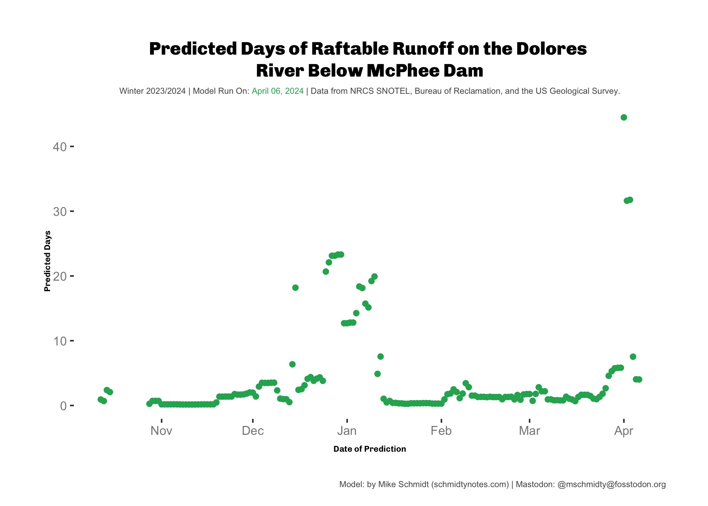

I have been less enthusiastic about predicting if the Dolores will have a raftable release this year due to an average snowpack.  In January there was a potential for a release when the model was predicting 20 days.  But other than that the model has been fairly pessimistic.  In the last couple of days the model has had some really high predictions, above 40 days.  I think either the model thinks that we are close to having enough snow to have a release or there was some sort of weird reading at the snotel sites. Either way, I would say that there is a chance the Dolores runs this year, but I'd guess it is unlikely. 

If you want to read about how I made this model I wrote about [building the model last year](blog/r/2023-01-03-dolores_river_flow_predict). I also have all the model scripts, including this year, plus a GitHub action that ran the model a couple of times a week last year [on github](https://github.com/mschmidty/dolores_flow_predict). 

Moving forward I'd like to continue my ["Just Do Statistics"](blog/statistics/learning_bayes_day1) theme and try to build a model using a Bayesian approach so that I can predict the outcomes probabilistically.  Not sure if I'll have time.  Maybe next year. 