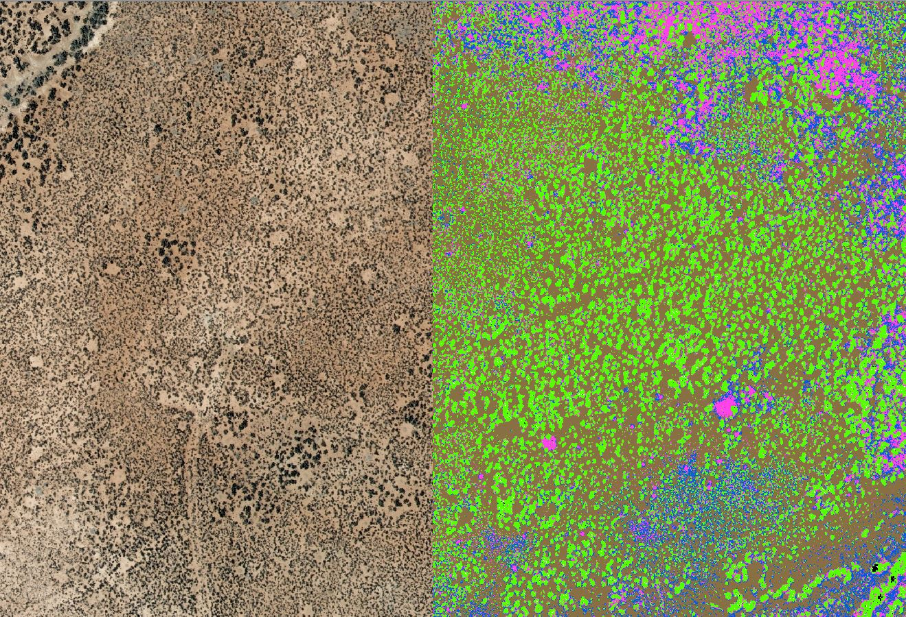
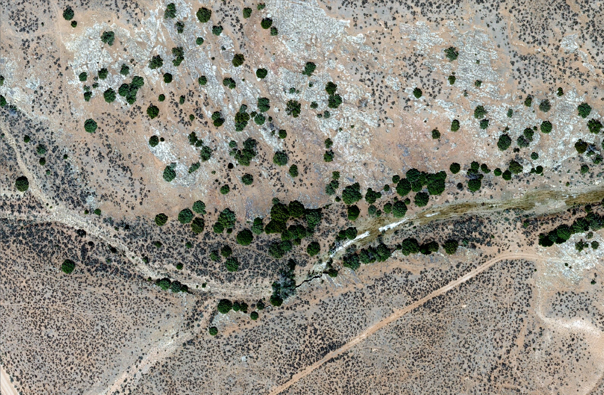
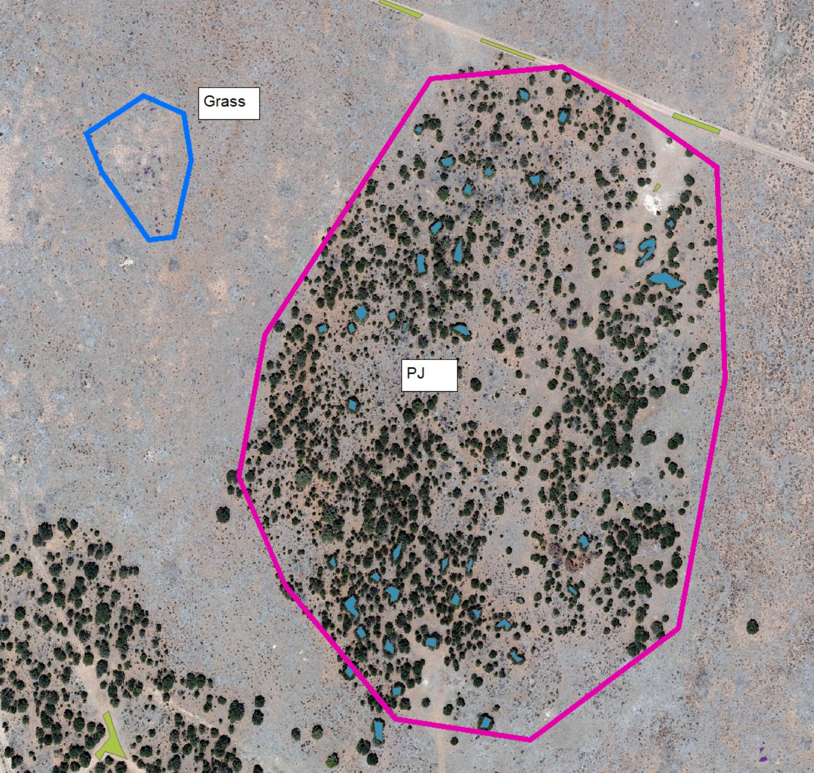
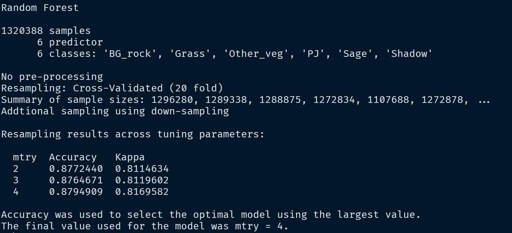
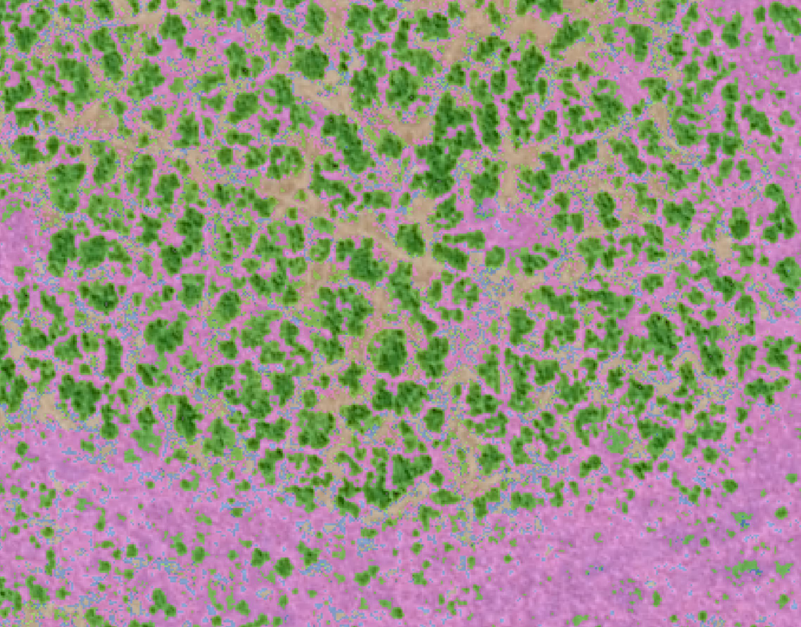
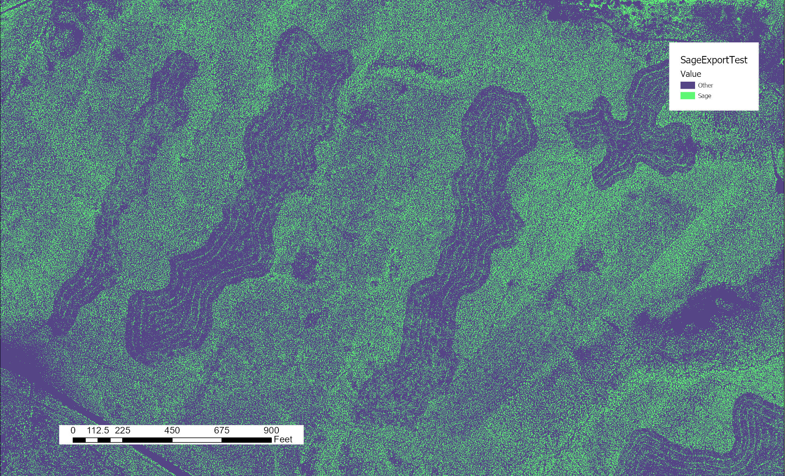
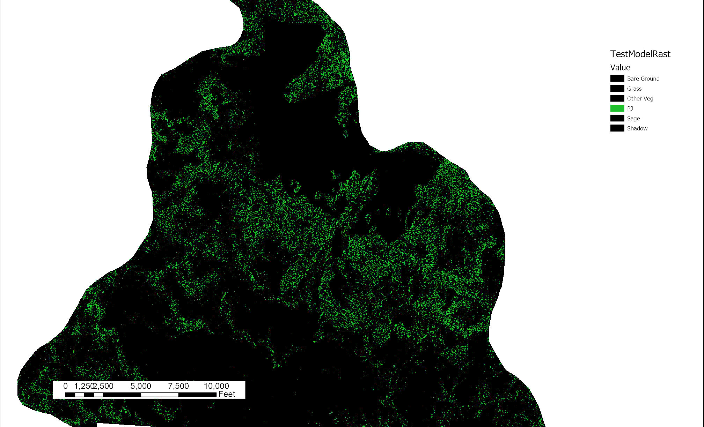
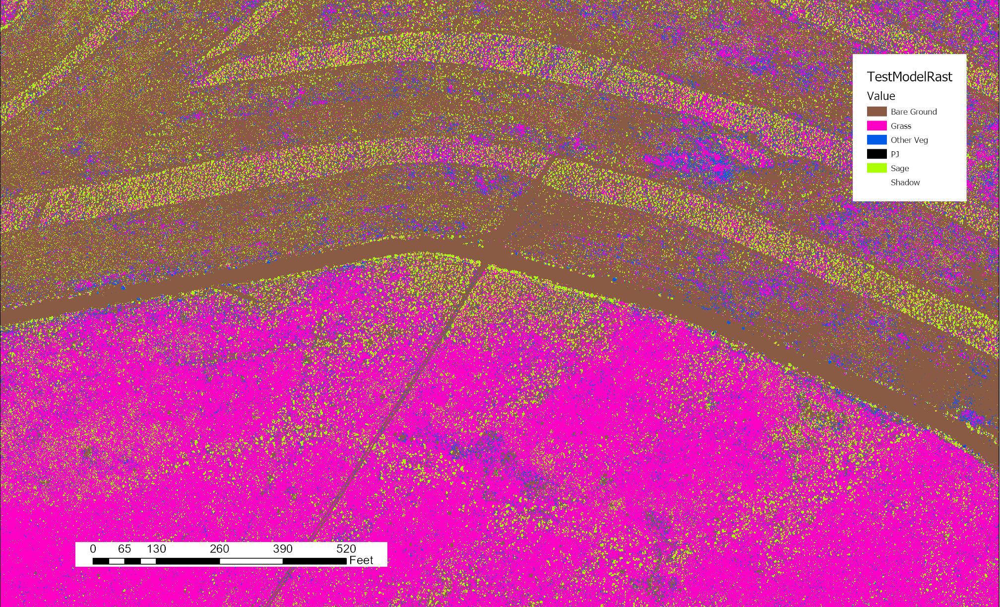
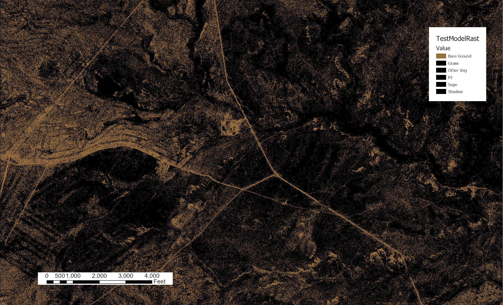

A few years ago the Bureau of Land Management office I worked for was part of a project to map vegetation in Sage-grouse habitat. To do that we got 10 cm resolution aerial imagery across the species range. The following is a summary of the project, what I learned, what I would do differently, and why the project ended without ever really contributing to any on the ground management. 


*A capture of the image on the left and the classified image on the right.*

## What the project was and why we did it
The goal of the project was to see if we could use aerial imagery to map vegetation in sage-grouse habitat.  We thought this would help management because we had GPS collars on sage-grouse and we thought fine scale raster based vegetation information could help us make management decisions.  Some of the questions we had were: 

1. What percent sagebrush cover do sage-grouse prefer in any given season?
2. What percent bare ground is avoided if any?
3. How far do grouse avoid PJ?
   
We never really got that far, because even though we did get to a place where the predictions of vegetation were fairly accurate, we couldn't get them into fine enough categories to be useful.  Probably the most important distinction that we couldn't tease out was black sagebrush (*Artemisia nova*) vs big sagebrush (*Artemisia tridentata*).  Sage-grouse use each differently and so not being able to distinguish between the two kind of made it so the product was less useful. 

## The dataset
The imagery we were trying to classify was 4 band 10 cm resolution aerial imagery flown over a few days.  The four bands were the standard red, blue, green, and near infrared.  There was also a point cloud that was used to orthorectify the imagery that was at fine enough of a scale that we used it to try and get height of some vegetation. I don't think we put a lot of thought into what bands we wanted for classification because the imagery was purchased in a rush with end of the year money. 

The datasets most important attribute was just how big it was.  There are plenty of larger datasets out there but for us and our tiny little government computers 10cm resolution imagery was huge. I think one population was approximately 322Gb of data. The nice thing about the data is that it came to us in tiles that were max size of 2Gb. Regardless, my computer was an 8 core 32 Gb of Ram Dell that looked like a brick. Surprisingly this wasn't a problem for classifying the imagery but it wasn't big enough to make the predictions on all the tiles. To make the predictions I used a computer at the national operation center remotely.  It's biggest advantage is that it had 48 cores and allowed for parallel predictions on a relatively large machine.


*An example image with Pinyon Juniper and bare ground*

## Building the training data
We made a training dataset by drawing polygons around vegetation manually based on some on the ground surveying we had done previously. We drew polygons for each category we wanted to classify.  The original categories were: 
1. Bare Ground/Rock
2. Grass
3. Sagebrush
4. Pinyon and Juniper
5. Other Veg
6. Shadow - Largely included for the shade created by pinyon and juniper. 

Later we would add Black Sage as a category but were unsuccessful. 


*Example of training polygons drawn on raw imagery. Grass polygons are hardly visible, bare ground polygons are in yellow and the pinyon juniper polygons are in light blue.*

These polygons were drawn on multiple tiles so that we had examples for each category on many tiles.  The tiles were captured, in relatively short period of time, but they still had subtle differences between them. So even though they were really similar it was good to have examples from each category on many tiles. 

Next we extracted the imagery values for the training polygons across all the tiles that they were drawn, so we had the known values for each vegetation class. Prior to extracting, we added in heights as a fourth band, which we had calculated using the point cloud used to orthorectify the imagery (I was not part of calculating the heights, although I did play around with that using the [{LAStools}](https://lastools.github.io/) and [{lasR}](https://r-lidar.github.io/lasR/)R packages). The training dataset consisted of over 1.5 million training observations in the end.  

## Building the model
We used the [{caret}](https://topepo.github.io/caret/index.html) package to build the random forest model. To tune the model we used cross validation to tune mtry. The code to build the model and then do some initial model assessment looked something like this: 

```r
library(doParallel)
library(caret)

no_cores<-detectCores()-2
registerDoParallel(cores=no_cores)

cl<-makeCluster(no_cores)

control <- trainControl(method = "repeatedcv", 
                     number = 10, 
                     repeats = 3, 
                     sampling="down"
                     )

mtry<-c(2,4)
tunegrid <-expand.grid(.mtry = mtry)

caret_fit_base<-train(as.factor(class)~ . , 
                  data=data_train,
                  method="rf",
                  metric="Accuracy",
                  preProcess = c("scale", "center"),
                  ntree=1000,
                  trControl=control, 
                  importance = TRUE, 
                  tuneGrid = tunegrid, 
                  verbose = TRUE,
                  allowParallel = TRUE
                  )

stopCluster(cl)

caret_fit_base

varImp(caret_fit_base)

prediction<-bind_cols(data_test, predict = predict(caret_fit_base, data_test))

caret::confusionMatrix(as.factor(prediction$class), prediction$predict)

prop.table(caret::confusionMatrix(as.factor(prediction$class), prediction$predict)$table, 2)


saveRDS(caret_fit_base, "model_runs/combined_vars/combined_vars.rds")
```


*An example of a model summary from one of the model runs.*

Building the model didn't really take that much compute. I could build the model on my 8 core 32 Gb of Ram work computer.  

Some notes on the process: we down sampled the data so that each class had the same number of observations as the class with the minimum number of training observations.  The only tuning we really did was a repeated cross validation to decrease the likelihood of over fitting.  I think increasing the amount of repeats would have produced better results, but on my machine this seemed to get us reasonable results without taking an outrageous amount of time.  And even though I had access to a much bigger computer, moving things back and forth was a real barrier with the slow rural internet I had access to. 

It would have been interesting too, to try an algorithm like XGboost on this dataset to more finely tune the model.  

## Some things I wish we had done differently
I made probably 20 to 30 models for this project and altered the training data probably that many times at least. One of the biggest things I'd wished I knew about is the [{targets}](https://books.ropensci.org/targets/) package. I've had varying success using targets with spatial data, but I still think it would have helped, even if it was just keeping track of the model inputs and helping me think about stringing everything together earlier.  There were so many times I'd do something at one step in the process, and it would break something later. I had to take a long time figuring out how to pass everything through the chain after things broke.  Even though this wasn't the most complex project it had quite a few steps.  And due to mediocre organization I lost a lot of time looking for bugs. Working across two computers too added a level of complexity. {targets} definitely would have helped. 

The next thing that I think would have helped would have been to use the [{tidymodels}](https://www.tidymodels.org/) instead of caret.  Tidymodels was still in its infancy when I did this project – I did try to use tidymodels at the end – and I hadn't learned it well enough to use it. This I kind of think was minor. 

These are just process ideas.  Overall I go the job done.  I think these would have added some organization and would have sped up the process but overall I don't think they would have led to a better product.  Later I'll talk about how we could have gotten to a better product. 

## Making the predictions
Interestingly, one of the most complicated parts of this process was to batch predict all the tiles for an entire population.  This was challenging becuase of how large each tile was and because of how much data an entire population was.  For this I had to use a 48 CPU computer housed at the NOC.  Even then, due to memory issue, running the prediction took the better part of a weekend. It took approximately 3 hours to predict each tile. This is another place where targets, and its multicore functionality as a default, could have helped.  On Windows at the time it was a little hacky to spin up all those cores and make the predictions.  And once they were going, they were prone to error, which would kill that core for the rest of the run (I played around with try catch functions but couldn't get them to work). Here is the function that I used to predict each tile: 

```r
predict_raster2<-function(tile_path, model, height_raster_folder=FALSE, model_name, output_folder = NULL){
  
  if(height_raster_folder==FALSE){
    raster_to_predict<-brick(tile_path)
    names(raster_to_predict)<-c("band1", "band2", "band3", "band4")
  }else{
    height_raster<-lfn_2(tile_path, height_raster_folder)%>%
      raster()
    
    raster_to_predict<-height_merge2(tile_path, height_raster)
    names(raster_to_predict)<-c("band1", "band2", "band3", "band4", "height", "MSAVI2")
  }

  prediction<-predict(raster_to_predict, model)
  
  if(!is.null(output_folder)){
    output_path = output_folder
  }
  
  output_path<-paste0(output_path,
                      "/MODEL_",
                      model_name, 
                      "_TILE_",
                      sub(pattern = "(.*)\\..*$", replacement = "\\1", basename(tile_path)),
                      ".tif"
  )

  writeRaster(prediction, output_path)
  
  print(paste0("Tile ", tile_path, " finished @: ", Sys.time()))
}
```

The function above was used in parellel.  The function I used to run that function is below. This time I used 15 cores (If I remember correctly I couldn't use all 48 because the machine would run out of memory, also in the end we were experimenting with using MSAVI2 an vegetation index that I would likely not use again):

```r
library(parallel)
library(here)
library(tidyverse)

tiles<-tibble(
  tile_path=list.files("DATA/Tiffs_W_SM", pattern = ".tif$", full.names = T),
  tile_name=list.files("DATA/Tiffs_W_SM", pattern = ".tif$")
)

complete_tiles<-tibble(tile_name=list.files("model_runs/add_shadow_no_normalize_MSAVI", pattern = ".tif$"))%>%
  mutate(tile_name=str_extract(tile_name, "(?<=TILE_).*$"))

tiles<-tiles%>%
  anti_join(complete_tiles)%>%
  pull(tile_path)

shadow_model<-readRDS("model_runs/add_shadow_no_normalize_MSAVI_V2/training_polygons12N_09152020_ADD_SHADOW.rds")

cl<-makeCluster(15)
clusterExport(cl, varlist=c("shadow_model", "lfn_2", "height_merge2"), envir=environment())
clusterEvalQ(cl, 
             list(library(tidyverse), 
                  library(raster), 
                  library(RStoolbox), 
                  library(here),
                  rasterOptions(
                    tmpdir = here("temp_rasters"),
                    maxmemory = 5e+10,
                    chunksize = 1e+09
                  )
             )
)

start_time<-Sys.time()
parLapply(cl, tiles, predict_raster2, 
          model = shadow_model, 
          height_raster_folder="DATA/NOC_heights/WestSM_dZgridded" ,
          model_name="shadow_model_and_MSAVI_V2", 
          output_folder="model_runs/add_shadow_no_normalize_MSAVI_V2")

Sys.time()-start_time

stopCluster(cl)
```

## The results


*Model predictions for all of Dry Creek Basin, a large portion of the San Miguel Population.*

Overall I think the model performed amazingly well for predicting the six broad categories across so many pixels. There were a few weird tiles that I think were flown on a different day, so they were just off in the prediction. But overall, I think this prediction could have been useful.  


*Pink is grass, green is sage, and brown is bare ground.* 

## Evaluating the model runs
I think it would have helped if we had set up evaluation criteria early on to evaluate the models. I was relatively new to this, so that wasn't really a priority.  My priority was making training data, building models, making predictions and figuring out how to utilize a 48 core machine.  Pretty much through the whole process I was evaluating the models through the model summaries, predicting the testing dataset, and visually. And to be honest visual evaluation was really helpful for most of the process.  When you predicted many tiles you could tell relatively easily if you needed training data from a larger number of tiles.  You could also see overfitting if it existed.  One of the cool things about prediction vegetation is that you can see the errors and they are fairly apparent.  

But it would have been much better if we had a testing criterion.  We had vegetation plots that we could have measured these predictions against.  And I think that would have helped us communicate the need to continue with the project. It would have also given us a real understanding of our true error which I think would have been helpful early on.  You can only look at so many pixels and it would have been helpful to know that x percent of the areas were good but y percent were just awful or whatever the real answer waas. 
 
## What else could we have improved on?

I think the biggest thing we could have improved on was to do a bit more feature engineering on the dataset.  For example, I think it would have been interesting to see what adding slope, aspect and elevation to the model would have done. I would have also like to have added the date of acquisition of the tiles, and x and y coordinates as inputs.  Date of acquisition I think would have been big.  There were a few tiles that were captured on different days and those days were smokey, making the pixel values differ from the rest of the tiles.  

I also wonder if we had simplified the classes if we could have gotten to a better place.  For example, one thing I wanted to try was to predict all sagebrush together and then take that resulting layer, use it as a mask, and try to parse black and big sage from just the unmasked pixels.  I'm not sure that this would have worked, but I think it would have reduced complexity in what we were trying to accomplish.   

I've already talked about validating the data, but I also think a big part of that was telling the story of why and what we were doing.  I kind of picked this project up because I was bored.  My boss was supportive and saw the vision for trying to do this but I'm not sure beyond him and the folks I worked with at the National Operation Center that people understood what we were doing. 

## Some thoughts on this not amounting to much
I don't think that this project ever amounted to much.  Part of that I think is my fault.  I worked on this project during COVID and was board and kind of just tinkering. And I didn't really have a goal other than to see what I could do.  That in itself I think is fine.  We should tinker in land management a little more to see if there are better ways to do things.  But I think this could have been useful.  And if I had done a better job asking what people wanted, and thinking about how to use the dataset I think it would have had a better chance of being used.  Ultimately we just predicted the one population, when the thought was that we were going to predict vegetation for all the populations. 

While I think the selling and the thinking about the goals earlier was on me, I also think that agencies are just a bit antiquated. The BLM is much better than the Forest Service (my current employer).  But they, for the most part with a few exceptions, are living 10, 15 or 20 years ago.  We have been really slow to use new tools to do things.  And when new tools are developed, people are resistant to adopt them.  They are resistant because change is hard, and I appreciate that.  But I also think there is just too much old school, manual thinking that could use to be re-evaluated.  I'm not saying that all new things should be blindly adopted.  But I do think more should be considered.  To a large degree I think the BLM saw that.  The Forest Service, isn't even really considering more modern approaches.  

## More cool images
Anyway that was my experience trying to predict to vegetation class high resolution aerial imagery in sage-grouse habitat. 

Here are a few more images for fun. 


*Sagebrush prediction where old sage treatments were conducted. Even after 10 years sagebrush is extremely reduced.*


*Pinyon juniper prediction. The dark areas in the upper part of the image show where PJ mastication projects had occurred.*


*I can't remember what treatments these were, but there were different treatments south and north of the road. They occurred over 30 years ago and had very different outcomes.*


*Bare ground prediction*