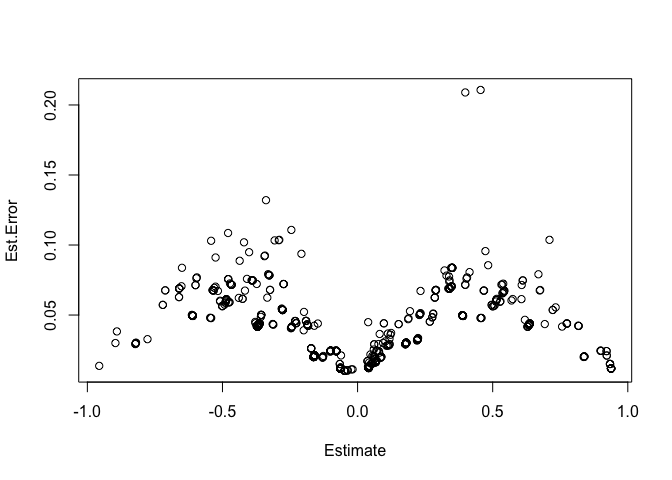

I’ve long wanted to get better at statistics. And largely I have. But I
still have a long way to go. I feel like I’m the best at machine
learning type stuff, mostly using decision trees. The predictions seem
to be the best. But I’m not really in to prediction as much as I am into
learning about the relationships that exist in the world. A lot of
machine learning is a black box.

One area of statistics that I’m particularly interested in is Bayesian
Statistics. I’m not going to lie, one of the reasons I’m interested in
Bayes statistics is that a lot of people that I follow on social media
are into it. But I also like that you can compute posterior
probabilities. I feel like looking at the world in this way makes sense
to me. But a lot of things about bayesian statistics don’t make a lot of
sense to me. How priors are generated doesn’t make a ton of sense to me,
for example.

But here we are, I’ve put a flag in the sand a made a folder on my blog
specifically for statistics. There’s not looking back (actually I
probably won’t follow through, and that is OK too). In the past I’ve
tried to learn statistics the old fashioned way reading textbooks. But
that honestly doesn’t work for me. I feel like the “Just Build Websites”
motto that the [ShopTalk Show](https://shoptalkshow.com) made famous is
how I learn the best. Learn by doing. For stats I’m calling it “Just Do
Statistical Analysis”

Today, to start I’m going to use the famous [Titanic Survivor
dataset](https://www.kaggle.com/competitions/titanic) to just try and do
some things bayesian ways with the brms package.

One note before I begin: If you are reading this, you should know I’m
learning statistics here and not teaching them. My interpretations and
methods here are my best effort but they are likely to be incorrect.

## Load Packages and the data

``` r
library(tidyverse)
library(brms)
library(janitor)
library(MetBrewer)
library(lubridate)


gender_submission<-read_csv("data/gender_submission.csv")
test<-read_csv("data/test.csv")
train<-read_csv("data/train.csv")

theme_set(theme_minimal())
```

First lets explore the training data real quick.

The dependent variable, or predicted variable, we want to look at here
is Survived. To keep things simple for now I want to look at Pclass
(Passenger Class), Sex, Age, and Fare and I may incorporate Embarked.

Some exploration. Let’s look at sex first.

``` r
train|>
  count(Survived, Sex)|>
  ggplot(aes(Sex, n, fill=as.factor(Survived)))+
  geom_bar(position="dodge2", stat="identity")+
  scale_fill_manual(values=met.brewer("Renoir", 2))+
  labs(
    title="Survived by Sex"
  )
```

<!-- -->

``` r
train|>
  count(Survived, Sex)|>
  group_by(Survived)|>
  mutate(prop=n/sum(n))|>
  ungroup()
```

``` r
## # A tibble: 4 × 4
##   Survived Sex        n  prop
##      <dbl> <chr>  <int> <dbl>
## 1        0 female    81 0.148
## 2        0 male     468 0.852
## 3        1 female   233 0.681
## 4        1 male     109 0.319
```

85% of males died. Next let’s look at age.

``` r
train|>
  group_by(Survived, Sex)|>
  summarize(
    avg_age_survived=mean(Age, na.rm=T),
    med_age_survived=median(Age, na.rm=T),
    sd_age_survived = sd(Age, na.rm=T)
  )|>
  ungroup()|>
  arrange(Sex)
```

``` r
## # A tibble: 4 × 5
##   Survived Sex    avg_age_survived med_age_survived
##      <dbl> <chr>             <dbl>            <dbl>
## 1        0 female             25.0             24.5
## 2        1 female             28.8             28  
## 3        0 male               31.6             29  
## 4        1 male               27.3             28  
## # ℹ 1 more variable: sd_age_survived <dbl>
```

This is a bit interesting, of the female passengers, you were more
likely to survive if you were older while the male passengers you were
more likely to survive if you were young. This makes sense. Females were
and children were loaded on the boats first as I recall from the movie.
Let’s visualize this.

``` r
train|>
  ggplot(aes(color=as.factor(Survived), as.factor(Survived), Age))+
  geom_violin(alpha=0.5, linewidth=1.3)+
  geom_point(width=0.3, size=15, aes(color=as.factor(Survived)), alpha=0.25, shape=95)+
  stat_summary(fun=median, geom="crossbar", width=0.15, col="red", linewidth=1)+
  facet_wrap(~Sex)+
  scale_fill_manual(values=met.brewer("Renoir", 2))+
  scale_color_manual(values=met.brewer("Renoir", 2))+
  labs(
    title="Distribution of Survivors by Sex and Age"
  )
```

<!-- -->

Plotting the age and sex of survivors helps to see some nuance,
particularly in the male passengers. It seems that a larger proportion
of young males survived like we could see from the averages, but you can
also see that there’s something of a double distribution for the
survivors. There’s a larger proportion of older males who survived too
around the age of 30 and then it tapers off and the worst category
appears to be older men, the vast majority of which died.

## Fare

Let’s look at Fare now in the same way.

``` r
train|>
  group_by(Survived, Sex)|>
  summarize(
    avg_fare_survived=mean(Fare, na.rm=T),
    med_fare_survived=median(Fare, na.rm=T),
    sd_fare_survived = sd(Fare, na.rm=T)
  )|>
  ungroup()|>
  arrange(Sex)
```

``` r
## # A tibble: 4 × 5
##   Survived Sex    avg_fare_survived med_fare_survived
##      <dbl> <chr>              <dbl>             <dbl>
## 1        0 female              23.0             15.2 
## 2        1 female              51.9             26   
## 3        0 male                22.0              9.42
## 4        1 male                40.8             26.3 
## # ℹ 1 more variable: sd_fare_survived <dbl>
```

``` r
train|>
  ggplot(aes(color=as.factor(Survived), as.factor(Survived), Fare))+
  geom_violin(alpha=0.5, linewidth=1.3)+
  geom_point(width=0.3, size=15, aes(color=as.factor(Survived)), alpha=0.25, shape=95)+
  stat_summary(fun=median, geom="crossbar", width=0.15, col="red", linewidth=1)+
  facet_wrap(~Sex)+
  scale_fill_manual(values=met.brewer("Renoir", 2))+
  scale_color_manual(values=met.brewer("Renoir", 2))+
  labs(
    title="Distribution of Survivors by Sex and Fare"
  )
```

<!-- -->

In this case the numbers seem to be more helpful. It’s clear that the
greater the fare amount the more likely you are to survive.

Let’s make one more plot just to look at the variables in another way.

``` r
train|>
  ggplot(aes(Age, Fare, color=as.factor(Survived)))+
  geom_point(size=4, alpha=0.5)+
  scale_color_manual(values=met.brewer("Renoir", 2))+
  labs(
    title="Comparison of Age and Fare by Survived"
  )
```

<!-- --> Not
much help.

## Pclass

``` r
train|>
  count(Survived, Pclass)|>
  group_by(Survived)|>
  mutate(prop=n/sum(n))|>
  ungroup()|>
  arrange(Pclass, Survived)
```

``` r
## # A tibble: 6 × 4
##   Survived Pclass     n  prop
##      <dbl>  <dbl> <int> <dbl>
## 1        0      1    80 0.146
## 2        1      1   136 0.398
## 3        0      2    97 0.177
## 4        1      2    87 0.254
## 5        0      3   372 0.678
## 6        1      3   119 0.348
```

``` r
survived_by_sex_and_pclass<-train|>
  count(Survived, Sex, Pclass)|>
  group_by(Sex, Pclass)|>
  mutate(prop=n/sum(n))|>
  ungroup()|>
  arrange(Pclass, Sex, Survived)

survived_by_sex_and_pclass
```

``` r
## # A tibble: 12 × 5
##    Survived Sex    Pclass     n   prop
##       <dbl> <chr>   <dbl> <int>  <dbl>
##  1        0 female      1     3 0.0319
##  2        1 female      1    91 0.968 
##  3        0 male        1    77 0.631 
##  4        1 male        1    45 0.369 
##  5        0 female      2     6 0.0789
##  6        1 female      2    70 0.921 
##  7        0 male        2    91 0.843 
##  8        1 male        2    17 0.157 
##  9        0 female      3    72 0.5   
## 10        1 female      3    72 0.5   
## 11        0 male        3   300 0.865 
## 12        1 male        3    47 0.135
```

``` r
survived_by_sex_and_pclass|>
  mutate(class=paste("Class", Pclass, sep=" "))|>
  ggplot(aes(Sex, n, fill=as.factor(Survived)))+
  geom_bar(position="dodge2", stat="identity")+
  facet_wrap(~class)+
  scale_fill_manual(values=met.brewer("Renoir", 2))+
  labs(
    title="Sex by number of survived per class"
  )
```

<!-- -->

This is brutal. Pclass is a big deal in survivorship. Almost all fo the
deaths came from men in 3rd class.

## Just Do Statistics

Here I am going to start with a simple logistic regression.

``` r
set.seed(1234)
logit_lm<-glm(as.factor(Survived)~Sex + Age + Pclass + Fare, data=train, family = binomial())

summary(logit_lm)
```

``` r
## 
## Call:
## glm(formula = as.factor(Survived) ~ Sex + Age + Pclass + Fare, 
##     family = binomial(), data = train)
## 
## Coefficients:
##               Estimate Std. Error z value Pr(>|z|)    
## (Intercept)  4.9880403  0.5721894   8.717  < 2e-16 ***
## Sexmale     -2.5181969  0.2078562 -12.115  < 2e-16 ***
## Age         -0.0367073  0.0076795  -4.780 1.75e-06 ***
## Pclass      -1.2697410  0.1586252  -8.005 1.20e-15 ***
## Fare         0.0005373  0.0021821   0.246    0.805    
## ---
## Signif. codes:  
## 0 '***' 0.001 '**' 0.01 '*' 0.05 '.' 0.1 ' ' 1
## 
## (Dispersion parameter for binomial family taken to be 1)
## 
##     Null deviance: 964.52  on 713  degrees of freedom
## Residual deviance: 647.23  on 709  degrees of freedom
##   (177 observations deleted due to missingness)
## AIC: 657.23
## 
## Number of Fisher Scoring iterations: 5
```

A few notes on the results:

- Fare seems to be the least significant predictor.  
- 177 observations are missing some sort of data. Maybe imputing these
  data would be a good call?

Let’s predict the testing dataset and see how the model does.

``` r
login_lm_predict_v1<-test|>
  mutate(
    prediction=predict(logit_lm, test, type="response"),
    Survived=ifelse(prediction>0.5, 1, 0)
  )

login_lm_predict_v1|>
  select(PassengerId, Survived)|>
  write_csv("output/kaggle_submit_logit_lm_v1.csv")
```

On kaggle this was just shy if 60% correct. Not very good. I bet if we
did this a bunch it would not be much better than random. That’s not
totally the point here but it is at least good to keep track of. Let’s
see if we remove Fare if it gets better.

``` r
logit_lm_v2<-glm(as.factor(Survived)~Sex + Age + Pclass, data=train, family = binomial())

summary(logit_lm_v2)
```

``` r
## 
## Call:
## glm(formula = as.factor(Survived) ~ Sex + Age + Pclass, family = binomial(), 
##     data = train)
## 
## Coefficients:
##              Estimate Std. Error z value Pr(>|z|)    
## (Intercept)  5.056006   0.502128  10.069  < 2e-16 ***
## Sexmale     -2.522131   0.207283 -12.168  < 2e-16 ***
## Age         -0.036929   0.007628  -4.841 1.29e-06 ***
## Pclass      -1.288545   0.139259  -9.253  < 2e-16 ***
## ---
## Signif. codes:  
## 0 '***' 0.001 '**' 0.01 '*' 0.05 '.' 0.1 ' ' 1
## 
## (Dispersion parameter for binomial family taken to be 1)
## 
##     Null deviance: 964.52  on 713  degrees of freedom
## Residual deviance: 647.29  on 710  degrees of freedom
##   (177 observations deleted due to missingness)
## AIC: 655.29
## 
## Number of Fisher Scoring iterations: 5
```

It seems about the same as the last model in most of the predictors,
which makes sense because the last model said that Fare wasn’t that
important.

``` r
login_lm_predict_v2<-test|>
  mutate(
    prediction=predict(logit_lm_v2, test, type="response"),
    Survived=ifelse(prediction>0.5, 1, 0)
  )

login_lm_predict_v2|>
  select(PassengerId, Survived)|>
  write_csv("output/kaggle_submit_logit_lm_v2.csv")
```

Just slightly better. Let’s try to improve this now. Let’s try a few
things on this model before we give up on it. Let’s try Lasso
Regression.

Note: For this method we will need to impute the missing data in the
test set to submit it to Kaggle.

``` r
library(glmnet)
library(mice)
na_omit_train<-na.omit(train)

x<-model.matrix(as.factor(Survived)~Sex + Age + Pclass + Fare, data=na_omit_train)[,-1] 
y<-na_omit_train$Survived

lasso_cv_fit<-cv.glmnet(x, y, family="binomial", alpha=1)

print(lasso_cv_fit$lambda.min)
```

``` r
## [1] 0.01397348
```

``` r
imp_test<-mice(test, m=5, method="pmm", seed=500)
```

``` r
## 
##  iter imp variable
##   1   1  Age  Fare
##   1   2  Age  Fare
##   1   3  Age  Fare
##   1   4  Age  Fare
##   1   5  Age  Fare
##   2   1  Age  Fare
##   2   2  Age  Fare
##   2   3  Age  Fare
##   2   4  Age  Fare
##   2   5  Age  Fare
##   3   1  Age  Fare
##   3   2  Age  Fare
##   3   3  Age  Fare
##   3   4  Age  Fare
##   3   5  Age  Fare
##   4   1  Age  Fare
##   4   2  Age  Fare
##   4   3  Age  Fare
##   4   4  Age  Fare
##   4   5  Age  Fare
##   5   1  Age  Fare
##   5   2  Age  Fare
##   5   3  Age  Fare
##   5   4  Age  Fare
##   5   5  Age  Fare
```

``` r
complete_test<-complete(imp_test, 1)

test_x <- model.matrix(~Sex + Age + Pclass + Fare, data = complete_test)[,-1]
predicted_probs <- predict(lasso_cv_fit, newx = test_x, type = "response", s = lasso_cv_fit$lambda.min)


lasso_lm_predict_v1<-complete_test|>
  bind_cols(predict(lasso_cv_fit, newx = test_x, type = "response", s = lasso_cv_fit$lambda.min))|>
  mutate(
    Survived=ifelse(s1>0.5, 1, 0)
  )

lasso_lm_predict_v1|>
  select(PassengerId, Survived)|>
  write_csv("output/kaggle_submit_lasso_lm_v1.csv")
```

Interesting. This model was quite a bit better than the standard
logistic regression. It was 75% accurate. Let’s see if we can summarize
the coefficients below.

``` r
coef(lasso_cv_fit, s = lasso_cv_fit$lambda.min)
```

``` r
## 5 x 1 sparse Matrix of class "dgCMatrix"
##                        s1
## (Intercept)  3.9252026646
## Sexmale     -2.5605623874
## Age         -0.0283525886
## Pclass      -0.4421522522
## Fare         0.0001652399
```

Although this model works well it is still a bit of a black box. One
thing i’d say is that Fare seems to again not be much of a factor.
Pclass in this model also seems to be less impactful to the outcome than
the standard logistic regression.

## Let’s do some Bayes

The point of this was to learn Bayesian statistics. I felt like it was
important to build up to this by exploring the data and then doing a few
frequentest approaches, which I’m a bit more familiar with, before
diving in.

A few notes before we start. We know that being male and in class three
were the most likely to die. We also know that Males died in general
more than females. In all classes more males died than females. We also
know that Fare as it is in the original dataset isn’t that important to
the outcome.

Note: I spend like a week trying to install `rstan` and
[failed](https://stackoverflow.com/questions/76469180/rstan-wont-run-just-stops-at-prompt-selection?noredirect=1#comment134962812_76469180)
so I’m using `{cmdstanr}` as a backend here.

``` r
options(brms.backend = "cmdstanr")
bayes_fit_v1 <- brm(as.factor(Survived) ~ Sex + Age + Pclass + Fare, 
           data = train, 
           family = bernoulli("logit"), 
           prior = set_prior("normal(0,5)", class = "Intercept"),
           iter = 2000, chains = 10)
```

``` r
## -\|/-\|/-\|/-\|/-\|/-\|/-\|/-\|/-\| Running MCMC with 10 sequential chains...
## 
## Chain 1 Iteration:    1 / 2000 [  0%]  (Warmup) 
## Chain 1 Iteration:  100 / 2000 [  5%]  (Warmup) 
## Chain 1 Iteration:  200 / 2000 [ 10%]  (Warmup) 
## Chain 1 Iteration:  300 / 2000 [ 15%]  (Warmup) 
## Chain 1 Iteration:  400 / 2000 [ 20%]  (Warmup) 
## Chain 1 Iteration:  500 / 2000 [ 25%]  (Warmup) 
## Chain 1 Iteration:  600 / 2000 [ 30%]  (Warmup) 
## Chain 1 Iteration:  700 / 2000 [ 35%]  (Warmup) 
...Truncated Output...
```

``` r
summary(bayes_fit_v1)
```

``` r
##  Family: bernoulli 
##   Links: mu = logit 
## Formula: as.factor(Survived) ~ Sex + Age + Pclass + Fare 
##    Data: train (Number of observations: 714) 
##   Draws: 10 chains, each with iter = 2000; warmup = 1000; thin = 1;
##          total post-warmup draws = 10000
## 
## Population-Level Effects: 
##           Estimate Est.Error l-95% CI u-95% CI Rhat
## Intercept     5.04      0.59     3.91     6.20 1.00
...Truncated Output...
```

Again Fare doesn’t seem to help the prediction. Sex and class have the
greatest impact on the prediction. This also verified that being male,
being older and being a lower passenger class decrease the odds of
survival.

``` r
bayes_v1<-complete_test|>
  bind_cols(predict(bayes_fit_v1, complete_test))|>
  mutate(
    Survived=ifelse(Estimate>0.5, 1, 0)
  )

bayes_v1|>
  select(PassengerId, Survived)|>
  write_csv("output/bayes_v1.csv")
```

My first bayes attempt was about 75% accurate on Kaggle. That is pretty
good. It’s as good as the lasso predictions.

## Checking the Model

I’m learning about these using ChatGPT and Bayes Rules Book. To start
I’m going to run two checks: the Posterior Predictive Check and the
Residual Diagnostic.

``` r
pp_check(bayes_fit_v1)
```

<!-- --> In
this the black line is supposed to look like the other lines. Because I
haven’t seen a ton of these it seems like they do, but I would imagine
that this is a relative assessment.

``` r
plot(residuals(bayes_fit_v1))
```

<!-- --> In the
the residuals plot above there should be no pattern. To me there seems
to be a decent pattern. From what I understand this means that there
could be information in the predictors that the model is not using
effectively.

### improving the model.

Chat GPT recommended several ways to improve the model, I’ll work on two
here to keep this manageable:

1.  Improve your priors
2.  And Feature engineering including using interaction terms.

Lets add in a new field called child and then improve our priors in a
new model. I’m also going to impute data so that there are no missing
ages for both datasets and add in Embarked and Parch to see if it helps
(I did a bad job of this above so we are going to formalize it here).

``` r
set.seed(1234)
mice(test, m=5, method="pmm", seed=500)
```

``` r
## 
##  iter imp variable
##   1   1  Age  Fare
##   1   2  Age  Fare
##   1   3  Age  Fare
##   1   4  Age  Fare
##   1   5  Age  Fare
##   2   1  Age  Fare
##   2   2  Age  Fare
##   2   3  Age  Fare
##   2   4  Age  Fare
##   2   5  Age  Fare
##   3   1  Age  Fare
##   3   2  Age  Fare
##   3   3  Age  Fare
##   3   4  Age  Fare
##   3   5  Age  Fare
##   4   1  Age  Fare
##   4   2  Age  Fare
##   4   3  Age  Fare
##   4   4  Age  Fare
##   4   5  Age  Fare
##   5   1  Age  Fare
##   5   2  Age  Fare
##   5   3  Age  Fare
##   5   4  Age  Fare
##   5   5  Age  Fare
```

``` r
## Class: mids
## Number of multiple imputations:  5 
## Imputation methods:
## PassengerId      Pclass        Name         Sex 
##          ""          ""          ""          "" 
##         Age       SibSp       Parch      Ticket 
##       "pmm"          ""          ""          "" 
##        Fare       Cabin    Embarked 
##       "pmm"          ""          "" 
## PredictorMatrix:
##             PassengerId Pclass Name Sex Age SibSp Parch
## PassengerId           0      1    0   0   1     1     1
## Pclass                1      0    0   0   1     1     1
## Name                  1      1    0   0   1     1     1
## Sex                   1      1    0   0   1     1     1
## Age                   1      1    0   0   0     1     1
## SibSp                 1      1    0   0   1     0     1
##             Ticket Fare Cabin Embarked
## PassengerId      0    1     0        0
## Pclass           0    1     0        0
## Name             0    1     0        0
## Sex              0    1     0        0
## Age              0    1     0        0
## SibSp            0    1     0        0
## Number of logged events:  5 
##   it im dep     meth      out
## 1  0  0     constant     Name
## 2  0  0     constant      Sex
## 3  0  0     constant   Ticket
## 4  0  0     constant    Cabin
## 5  0  0     constant Embarked
```

``` r
train_cl<-train|>
  mice(m=5, method="pmm", seed=500)|>
  complete(1)|>
  as_tibble()|>
  mutate(age_class=ifelse(Age>=18, "Adult", "Child"))
```

``` r
## 
##  iter imp variable
##   1   1  Age
##   1   2  Age
##   1   3  Age
##   1   4  Age
##   1   5  Age
##   2   1  Age
##   2   2  Age
##   2   3  Age
##   2   4  Age
##   2   5  Age
##   3   1  Age
##   3   2  Age
##   3   3  Age
##   3   4  Age
##   3   5  Age
##   4   1  Age
##   4   2  Age
##   4   3  Age
##   4   4  Age
##   4   5  Age
##   5   1  Age
##   5   2  Age
##   5   3  Age
##   5   4  Age
##   5   5  Age
```

``` r
test_cl<-test|>
  mice(m=5, method="pmm", seed=500)|>
  complete(1)|>
  as_tibble()|>
  mutate(age_class=ifelse(Age>=18, "Adult", "Child"))
```

``` r
## 
##  iter imp variable
##   1   1  Age  Fare
##   1   2  Age  Fare
##   1   3  Age  Fare
##   1   4  Age  Fare
##   1   5  Age  Fare
##   2   1  Age  Fare
##   2   2  Age  Fare
##   2   3  Age  Fare
##   2   4  Age  Fare
##   2   5  Age  Fare
##   3   1  Age  Fare
##   3   2  Age  Fare
##   3   3  Age  Fare
##   3   4  Age  Fare
##   3   5  Age  Fare
##   4   1  Age  Fare
##   4   2  Age  Fare
##   4   3  Age  Fare
##   4   4  Age  Fare
##   4   5  Age  Fare
##   5   1  Age  Fare
##   5   2  Age  Fare
##   5   3  Age  Fare
##   5   4  Age  Fare
##   5   5  Age  Fare
```

Now lets build a new model leaving the priors the same for now but
adding in new variables and an interaction between age_class and sex
while removing age (because I figure that age and age_class are highly
correlated). I’m also going to remove Fare. I think that it will also
have some impact but we may need to categorize this as well.

``` r
bayes_fit_v2 <- brm(as.factor(Survived) ~ Sex * as.factor(age_class) + Pclass + Fare + as.factor(Embarked) + Parch, 
           data = train_cl, 
           family = bernoulli("logit"), 
           prior = set_prior("normal(0,5)", class = "Intercept"),
           iter = 2000, chains = 10)
```

``` r
## -\|/-\|/-\|/-\|/-\|/-\|/-\|/-\|/ Running MCMC with 10 sequential chains...
## 
## Chain 1 Iteration:    1 / 2000 [  0%]  (Warmup) 
## Chain 1 Iteration:  100 / 2000 [  5%]  (Warmup) 
## Chain 1 Iteration:  200 / 2000 [ 10%]  (Warmup) 
## Chain 1 Iteration:  300 / 2000 [ 15%]  (Warmup) 
## Chain 1 Iteration:  400 / 2000 [ 20%]  (Warmup) 
## Chain 1 Iteration:  500 / 2000 [ 25%]  (Warmup) 
## Chain 1 Iteration:  600 / 2000 [ 30%]  (Warmup) 
## Chain 1 Iteration:  700 / 2000 [ 35%]  (Warmup) 
...Truncated Output...
```

``` r
bayes_fit_v2
```

``` r
##  Family: bernoulli 
##   Links: mu = logit 
## Formula: as.factor(Survived) ~ Sex * as.factor(age_class) + Pclass + Fare + as.factor(Embarked) + Parch 
##    Data: train_cl (Number of observations: 889) 
##   Draws: 10 chains, each with iter = 2000; warmup = 1000; thin = 1;
##          total post-warmup draws = 10000
## 
## Population-Level Effects: 
##                                 Estimate Est.Error
## Intercept                           4.17      0.45
...Truncated Output...
```

``` r
bayes_v2<-test_cl|>
  bind_cols(predict(bayes_fit_v2, test_cl))|>
  mutate(
    Survived=ifelse(Estimate>0.5, 1, 0)
  )

bayes_v2|>
  select(PassengerId, Survived)|>
  write_csv("output/bayes_v2.csv")
```

The model improved it’s accuracy by about one percent which isn’t
anything to write home about. And the visual checks.

``` r
pp_check(bayes_fit_v2)
```

<!-- -->

``` r
plot(residuals(bayes_fit_v2))
```

<!-- -->

The posterior predictive check looks ver similar to the first. The
residuals still have a pattern.

### Improving the priors

Now let’s improve the priors. I have to admit that priors confuse the
heck out of me. I feel like when they are explained it seems so simple
but then actually implementing them is complex and hard and confusing.

``` r
bayes_fit_v3 <- brm(as.factor(Survived) ~ Sex * as.factor(age_class) + as.factor(Pclass) + Fare + as.factor(Embarked) + Parch, 
           data = train_cl, 
           family = bernoulli("logit"), 
           prior = c(
            set_prior("normal(0,3)", class = "Intercept"),
            set_prior("normal(0,2)", class = "b")
          ),
           iter = 2000, chains = 5)
```

``` r
## -\|/-\|/-\|/-\|/-\|/-\|/-\|/-\|/-\|/-\|/-\| Running MCMC with 5 sequential chains...
## 
## Chain 1 Iteration:    1 / 2000 [  0%]  (Warmup) 
## Chain 1 Iteration:  100 / 2000 [  5%]  (Warmup) 
## Chain 1 Iteration:  200 / 2000 [ 10%]  (Warmup) 
## Chain 1 Iteration:  300 / 2000 [ 15%]  (Warmup) 
## Chain 1 Iteration:  400 / 2000 [ 20%]  (Warmup) 
## Chain 1 Iteration:  500 / 2000 [ 25%]  (Warmup) 
## Chain 1 Iteration:  600 / 2000 [ 30%]  (Warmup) 
## Chain 1 Iteration:  700 / 2000 [ 35%]  (Warmup) 
...Truncated Output...
```

``` r
summary(bayes_fit_v3)
```

``` r
##  Family: bernoulli 
##   Links: mu = logit 
## Formula: as.factor(Survived) ~ Sex * as.factor(age_class) + as.factor(Pclass) + Fare + as.factor(Embarked) + Parch 
##    Data: train_cl (Number of observations: 889) 
##   Draws: 5 chains, each with iter = 2000; warmup = 1000; thin = 1;
##          total post-warmup draws = 5000
## 
## Population-Level Effects: 
##                                 Estimate Est.Error
## Intercept                           2.87      0.36
...Truncated Output...
```

``` r
bayes_v3<-test_cl|>
  bind_cols(predict(bayes_fit_v3, test_cl))|>
  mutate(
    Survived=ifelse(Estimate>0.5, 1, 0)
  )

bayes_v3|>
  select(PassengerId, Survived)|>
  write_csv("output/bayes_v3.2.csv")
```

This did not seem to improve the model.

## Finishing up

Bayes was as good as Lasso which is cool and much better than `glm`. And
we know more about the data than we would if we just used Lasso. I’m
sure if we used a decision tree we could improve the model even more but
then we wouldn’t learn much about the relationship between the
predictors and the survival. To summarize:

- We know that being male was bad (“women and children first”).
- We know that being in first class was the best and that being in third
  class was really bad.
- It doesn’t seem that the port you left from is a strong predictor of
  survival.  
- If you were a male and a child you had a better chance of survival
  than if you were a female child. I would assume this is because of
  trying to preserve the family line, which is pretty interesting.
- I added parch in, which is the number of parents/children aboard the
  Titanic. I bet it would have been better if I did some feature
  engineering with this one, but it does seem to show that having
  parents or children decreased your likelihood of survival.
- Fare didn’t have any effect on survival. I have a hard time believing
  this. It seems that a bit of feature engineering we could tease
  something out of this.  
- This model can explain roughly 75% percent of the data. I’d like to
  look at the posterior probability of the predictions to see what the
  wrong predictions looked like but I feel I’ve done enough here for one
  day.  
- My priors didn’t really improve the model at all. But I think I
  learned something. I learned that you should probably make priors for
  each predictor instead of just `class="b"` or the beta coefficients. I
  should look into that.

## What next

I feel like this exercise was a good one. Making some models, focusing
on the process more than the results was a good approach that I think I
should repeat. I think my next step would be to take the same dataset
and continue to look at improving priors and maybe attempting to
understand the posterior probability of survival a little better.
